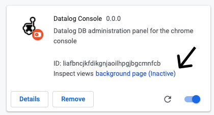

# datalog-console
Administration UI for Datascript, Datahike, and other Datalog databases

## Development

Make sure you have Java and the Clojure CLI [installed](https://clojure.org/guides/getting_started). There are ways to get by without these given this project mostly relies on Javascript, but using the Clojure JVM CLI allows us to resolve dependencies in a more flexible way, which comes in really handy when developing across dependencies.

```bash
yarn install
yarn dev
```
When running for the first time you will want to run Tailwind to generate the styles.

```bash
yarn build:tailwind:dev
```

### Load the dev extension into the Chrome browser

1. Go to `chrome://extensions/`
2. Turn on **developer mode** in top right
3. Load unpacked `your-file-path-to/datalog_console/shells/chrome`

To view the datalog panel open the Chrome console with either of these options.
- Right click anywhere on the page -> Inspect
- **Option + ⌘ + J**   (on macOS)
- **Shift + CTRL + J** (on Windows/Linux)

### Connect the REPL

You can connect a repl to each process by opening new windows in your terminal and doing the following.


- `yarn repl-background` - for the background page
- `yarn repl-panel` - for the devtool panel console

You can also connect your editor connected repl. Selecting build `chrome` gets you background and `chrome-devtool` gets you the panel.

### Runtime environments

There is **3 runtime environments** and 4 environments which both send and receive messages.
- Application environment
- **Content script**
- **Background script**
- **Chrome panel**

The first one you only have access to via postMessage to the window. You also get read and write access to the DOM (used to signal from the external Application environment that a Datalog DB is available). This is all done through `Content script`. Messages between the `Chrome panel` and `Content script` must go through `Background script`.

#### How to find the console of these environments

- Content script is executed in the standard browser Console
- Background is executed in the background. Found in figure (Fig: 1) below 👇
- Chrome panel is available by opening up the chrome console inside of _Datalog DB_ panel tab


(Fig: 1) - To view the background page go `chrome://extensions/` and click here:




### Quirks

Execution of code inside of `content-script` will not run on `www.google.com`